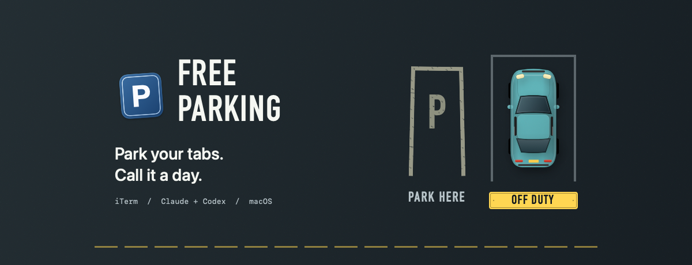

# Free Parking

Put your iTerm2 agent sessions away for the evening. One window becomes one car.
Click a car tomorrow to bring back its conversations, folders and saved tab
titles, in the same tab order, window size and position.

**Early personal prototype.** Live tests passed for a two-tab Codex window and
for Claude Opus through the native app: park → restore → verify → remove.
Reopening focused the existing conversation instead of creating duplicates;
removing one car kept other cars and recovery files intact. These tests are
not a guarantee for every CLI version or interrupted task. Try a disposable
window first. Disposable folder-tab round trips also verified exact saved titles,
window geometry, automatic archival and per-window prompt-free closing.

> **Permissions are deliberately skipped when agents resume.** Claude uses
> `--dangerously-skip-permissions`; Codex uses `--sandbox danger-full-access`
> and `--ask-for-approval never`. Only use this personal workflow with code and
> conversations you trust. This is not a safe-default agent launcher.

## Set up

You need:

- **macOS 14 or later**, iTerm2, and Xcode Command Line Tools (`xcode-select --install`).
- Swift 5.9+ and the developer-tools `/usr/bin/python3`.
- Claude Code and/or Codex CLI, installed, signed in, and available in your
  interactive login `zsh`. Live-tested with Codex 0.153.2 and Claude Code 2.1.274.

```sh
git clone https://github.com/jacobsapps/FreeParking.git
cd FreeParking
bash scripts/build-app.sh
open "dist/Free Parking.app"
```

The build creates a locally signed app; it does not launch it or touch iTerm.
You can drag **Free Parking.app** from `dist` into Applications and open it like
any other app. This is a source build, not a notarized downloadable release.

When prompted, **allow Free Parking to control iTerm**. Reading windows uses
macOS **Automation**, not Accessibility or screen capture. It does not click
through your tabs or type into them to scan. If denied, enable access in
**System Settings → Privacy & Security → Automation**, then retry.

### Try the UI without touching any terminals

```sh
bash scripts/build-app.sh --preview
open "dist/Free Parking Preview.app"
```

Preview uses fictional sessions. Its separate app bundle contains no terminal
helpers or Automation entitlement, and cannot read or close your real tabs.

## Use it

1. Click the painted **P** or **Park my windows** beneath it. This saves
   **every open iTerm window**, then closes them. One window becomes one car.
   Recovery for **all** windows is written and verified before **any** agent
   is interrupted or window closes.
2. **Click a car** to reopen that window. Already-open, verified conversations
   are brought forward instead of duplicated. Saved tab titles and the window's
   size and position are restored on newly created windows.
3. Once every saved session, folder and tab order is verified, the car **drives
   away into the archive automatically**. If anything is uncertain, it stays.
   Click the **archive icon → Bring back car** to recover it at any time.

No bottom toolbar or scrolling home screen. The painted P stays available beside
parked cars; larger collections use pages. **⋯ → Show tabs / Recovery** is there
only if needed. **Remove car** archives manually: without a verified match it
asks first, and it never closes terminals. Recent cars have weekday registration
plates; older cars show dates. Animations respect macOS Reduce Motion.

### Close warnings and saved titles

Free Parking never changes iTerm's normal close-confirmation setting. If you
already enabled **iTerm → Settings → General → Magic → Enable Python API** and
installed iTerm's Python runtime from its **Scripts** menu, Free Parking uses
that runtime to close **only the exact saved window**, without another prompt.
It also uses the API to restore custom tab titles. No extra service, hook or
package is installed by Free Parking. Keep iTerm's normal API authentication on.

Without that API/runtime, closing uses your normal iTerm confirmation (or closes
immediately if you disabled the confirmation yourself). Basic titles use an
AppleScript fallback. If a custom title cannot be restored, the car is kept and
the app explains how to enable the API; retrying does not duplicate tabs.
Permission failures or uncertain API close results stop parking and keep recovery.

Idle zsh tabs are saved as folders and reopen as shells. A standalone
`caffeinate` helper does not prevent parking; it is stopped after its window
closes, not resumed. Shell tabs do not resurrect previously exited agents or
preserve shell history/scrollback. Other running shell jobs and unidentified
agents block the operation with the affected window/tab named. Nothing closes
when this initial check fails.

Closing Free Parking itself does **not** park or close your terminals.
Cancelling an iTerm close confirmation stops the remaining parking sequence;
all recovery files remain. It cannot undo interrupts or closures that already
happened.

## Limits worth knowing

- **Local iTerm2 only: one agent or idle zsh per tab.** No split panes,
  tmux or SSH. Unknown work blocks parking rather than being silently killed.
- **A saved conversation is required.** Brand-new Codex sessions without a
  saved transcript may not be identifiable. Finish a turn and scan again.
- **Claude discovery uses local session metadata.** With the tested Claude
  version, the app matches its native process registry by PID, process birth
  time, working directory and exact saved transcript. No custom hook is needed.
  Older versions may require an already-installed terminal/session hook; Free
  Parking does not install hooks. Missing, stale or ambiguous metadata blocks
  parking rather than guessing. Non-default agent data directories are not
  currently supported.
- **This restores conversations, not running work.** It interrupts agents and
  may terminate their tracked child processes. It does not preserve drafts,
  running tasks, scrollback, split layouts or every custom CLI option. Detached work
  is not guaranteed to stop.
- **Geometry is saved from new parks only.** Older recovery files cannot restore
  a size they never recorded. If a display has been disconnected, restored windows
  are fitted onto an available screen. Full-screen/Spaces placement is not saved.
- **Keep the original transcripts.** Recovery files store session IDs, folders
  and restoration progress—not copies of your conversations. Moving a folder
  or deleting an agent's transcript can prevent automatic restoration.
- If a launch is ambiguous, the app keeps the car and stops instead of blindly
  opening duplicates. Inspect iTerm and use the car's recovery commands if needed.

## Privacy and recovery

No telemetry, accounts, cloud storage or network service in Free Parking.
Resumed agents retain their own normal network access. The app reads local
terminal/process metadata and agent session records.

Recovery files are private to your user and remain in:

```text
~/Library/Application Support/Car Park/
```

The original directory name is retained so the rename cannot strand backups.
**Do not publish this directory:** it contains local paths and session identities.
Removing a car archives its record; it does not delete the underlying recovery.
Permission/read errors keep the car rather than treating iTerm as absent.

## Development

Offline checks use fakes and do not interact with real terminals:

```sh
python3 -m unittest discover -s tests -p 'test_*.py'
node tests/test_iterm.js                         # optional: needs Node.js
mkdir -p .build
swiftc Sources/FreeParking/CarDateLabel.swift tests/CarDateLabelTests.swift -o .build/date-tests
.build/date-tests
swiftc -D FREE_PARKING_DEMO Sources/FreeParking/Models.swift Sources/FreeParking/PreviewFixtures.swift tests/GarageInteractionTests.swift -o .build/ui-model-tests
.build/ui-model-tests
swiftc Sources/FreeParking/CarManoeuvre.swift tests/CarManoeuvreTests.swift -o .build/motion-tests
.build/motion-tests
```

The icon and banner are generated from Swift drawing code, with no downloaded
image or font assets. Rebuild them with `bash scripts/build-icon.sh` and
`bash scripts/build-banner.sh`.

Before publication, run `python3 scripts/check-release-files.py` and manually
inspect the exact files being committed. Local screenshots, review HTML,
session data, notes, credentials and builds must stay excluded. The scanner is
a preflight, not a guarantee.

## License

A license has not yet been selected. This public source preview does not yet
grant an open-source license.
